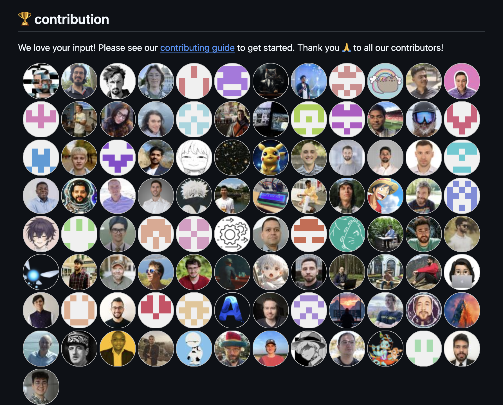
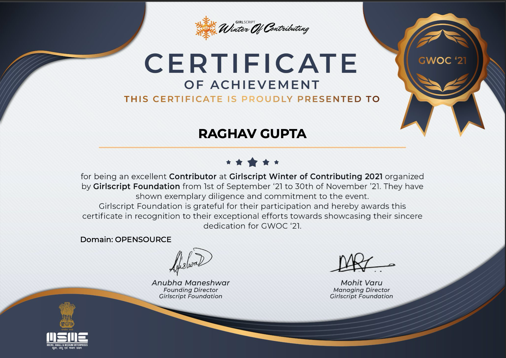

# Hi there! 👋 I'm Raghav Gupta

---

## **About Me**
- 📌 **Decision Analytics Associate @ ZS Associates** (Jun 2025 - Present) - Defining key business questions and designing quantitative/qualitative research approaches for global MedTech & biopharma clients across US, EU, LATAM, & APAC markets
- 📌 **Product Manager @ Fairdeal.Market** (May 2025 - June 2025) - Led the OneFairYear campaign from planning to execution, increasing DAU by 15%
- 📌 **Associate Software Engineer @ Tech Mahindra** (Sept 2024 - Apr 2025) - Designed & deployed full-stack applications on AWS EKS with high availability, scalability, and security
- 🔧 **Product Growth Analyst @ Blue Max Ind.** (Jan 2023 - Aug 2024) - Optimized user acquisition, retention, & monetization strategies, boosting user base by 12%+ in 6 months
- 🔧 **Data Acquisition Engineer @ Team Jatayu** (Jan 2022 - Dec 2022)
- ✍️ **Open Source Contributor | Technical Writer @ GirlScript Foundation**

I'm passionate about **Product Growth, Data-Driven Insights, Cloud Infrastructure, and AI**. I thrive on solving challenging problems, designing scalable systems, and optimizing product strategies through quantitative and qualitative analysis. My expertise spans product management, DevOps engineering, and business analytics across MedTech, SaaS, and tech sectors. 

---

## **🔨 Tech Stack & Skills**
### **🛠 Technical Skills:**
- **Programming:** Python | C/C++ | Java | Shell Scripting  
- **DevOps & Cloud:** AWS (EC2, EKS, ECR, IAM, S3, RDS) | Docker | Kubernetes | Terraform | Linux | CI/CD (Jenkins/GitLab)
- **Data & Analytics:** SQL | Tableau | Hadoop | AWS QuickSight
- **Version Control:** Git | GitHub | GitLab  

### **📈 Product & Business:**
- Agile | OKRs | JIRA | Analytics (Mixpanel) | Market Research | NPD Studies | Willingness-to-Pay Analysis | Competitive Analysis | VBA

---

## **💼 Detailed Experience**

### **Decision Analytics Associate @ ZS Associates** (Jun 2025 - Present)
- Defined key business questions and designed quantitative/qualitative research approaches for global MedTech & biopharma clients across US, EU, LATAM, & APAC markets
- Led a 5-country (US, DE, BR, CN, KSA) quantitative Willingness-to-Pay study for an upcoming vaccine at AstraZeneca, building pricing & affordability models
- Built scenario-based Excel analysis workbook for Thermo Fisher Scientific, enabling segmentation, competitive, and pricing evaluation
- Delivered a 6-country Qual+Quant NPD study for Roche Diagnostics, analyzing feature prioritization for a next-generation diagnostic analyzer

### **Product Manager @ Fairdeal.Market** (May 2025 - June 2025)
- Worked as a Product Manager to write insightful PRDs
- Led the OneFairYear campaign from planning to execution, increasing DAU by 15%
- Interacted with users, understanding their journey & pain points, providing product suggestions and improvements implemented in further sprints

### **Associate Software Engineer @ Tech Mahindra** (Sept 2024 - Apr 2025)
- Designed & deployed a full-stack application on AWS EKS with high availability, scalability, and security across multi-AZ VPCs
- Automated AWS infrastructure using modular Terraform scripts (VPC, EKS, IAM, RDS, S3)

### **Product Growth Analyst @ Blue Max Ind.** (Jan 2023 - Aug 2024)
- Optimized user acquisition, retention, & monetization strategies, boosting user base by 12%+ in 6 months
- Conducted market research and competitive analysis to inform product roadmap
- Led projects to streamline onboarding, improving retention by 35% (Data from 2018-2024)

### **Data Acquisition Engineer @ Team Jatayu** (Jan 2022 - Dec 2022)
- Conducted requirement analysis with stakeholders & cross-functional teams to specify sensor installation & data collection parameters
- Installed sensors on ATV for accurate data acquisition and analysis

---

## **📌 Featured Projects**
🔹 [**CRED Garage Case Study**](#) - Conducted in-depth product analysis.  
🔹 [**Smart Traffic Management System**](#) - Designed a system enabling wireless communication between traffic lights and emergency vehicles. (Top 20 finalist in India)  
🔹 [**Cloud-Native Monitoring App**](#) - Deployed a scalable Flask app on Kubernetes using AWS EKS & ECR.  
🔹 [**Smart Traffic Management System with Priority Vehicles**](#) - Developed a system enabling wireless communication between traffic lights and emergency vehicles using radio signals. Top-20 finalist from all over India.

---

## **🎓 Education**
**Bachelor of Technology** - Maharaja Agrasen Institute of Technology (MAIT), Delhi  
**Graduation:** 2020 - 2024 | **Cumulative GPA:** 8.42 / 10.0

---

## **🏆 Achievements & Co-Curricular**
- President, Literary Umbrella (Official literary society of MAIT)
- USG Delegate Affairs, Secretariat of Columban MUN
- Won awards in Quizzing, MUNs, and Debates
- Open Source Contributor & GirlScript Foundation Achiever

---

## **✍️ Technical Blogs**
📌 [AI-Driven DevOps for Autonomous Space Missions](#)  
📌 [Role of DevOps in Space Exploration & Chandrayaan-3](#)  
📌 [What is Docker?!](#)  

---

## Accreditions in OS

## **📊 GitHub Stats**
  
  

---

## **🌍 Let's Connect**
  
  
📧 **Email:** [raghavgupta.ai@gmail.com](mailto:raghavgupta.ai@gmail.com)  

---

### 🚀 Always open to discussions on DevOps, Product Growth, and AI!
Let's innovate together! ✨

